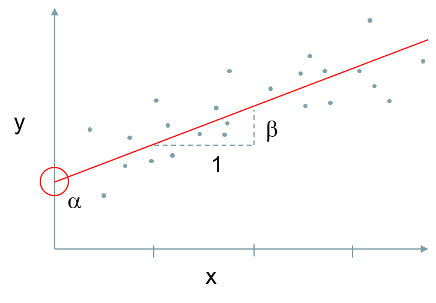

```{r setup, include=FALSE}
knitr::opts_chunk$set(echo = TRUE)
#../../content/post/
```
<br><br>

# Introduction

This tutorial is an introduction to linear and generalised linear models. It's written for people who are both new to `R`, and new to regression techniques.  It is in four parts:

+ Introduction and Linear regression models (LM)
+ Generalised Linear Models (GLM)
+ Multilvel Models (LMM / GLMM)
+ Smoothed regressions: Generalized Additive Models (GAM)


This section will focus on linear models.  You might use a linear regression on continuous data that are normally distributed (such as blood pressure, heights of a sample of people etc.).  They are fairly straight-forward to apply and understand, but a bit more challenging if we have different data types, such as binary _(yes/no, dead alive, readmitted/not readmitted etc.)_, count data _(can't be decimal or negative)_, categorical data _(e.g.  a variable with possible responses: 'none', 'some,' 'more' or 'a lot')_ etc.  For these cases, you might use a _Generalized Linear Model_ [@mccullaghGeneralizedLinearModels1989].

Some of the key assumptions of regressions are that we expect constant variance across the range of our data ('homoskedsticity'), and no correlation (relationships between our predictor vairables).  In cases where are data are not compleley indiependent, e.g. if look at England-level data 

I'm aiming to give a grounding in linear regression using 'ordinary least squares' (OLS), Logistic and Poisson regression using 'maximum likelihood estimation' (MLE).  This will not be in great mathematical depth, and will focus on using them in `R`, but there is a wealth of literature on the subject.  I'd suggest [@harrell2015regression; @woodGeneralizedAdditiveModels2017] excellent books.

# Regression Models

In regression, we are attempting to predict a variable $y$, using another $x$.  We will stick to a single $x$ variable for this post, but it can be expanded to many different $x$s in practice.  A multiple regression allows us to adjust for many factors when predicting $y$, and is the basis for indirectly-standardised ratios, such as the mortality ratio HSMR __ref__ and SHMI __ref__.  To understand the technique, we will start with a linear model before considering binary events (like death or readmission), or count-based data (like length-of-stay).

The figure below illustrates what goes on in linear regression.  We can describe $y$, by using an 'intercept' $\alpha$ (where our line crosses the $x$ axis), and how much $y$ increases when $x$ increases by one, the 'coefficient' $\beta$.



_The formula for this is therefore:_
$$ y = \alpha + \beta x + \varepsilon$$
+ $\alpha$<U+F061> = Intercept
+ $\beta$ = Coefficient (how much x affects y)
+ $\varepsilon$= Error (Residual)


<br>

## Linear Model 

### Create Dataset

To demonstrate a linear model, we will first generate some appropirate data.  We will set the 'seed' which aligns the random number generator so it is reproducible on your own machine.  We will then use the normal distribution functions to create '$y$' and '$x$'.  Some of the functions used below work best with `data.frames`, so we'll combine our $y$ & $x$ into a `data.frame` called `dt`.

```{r intro, message=FALSE}
library(ggplot2)

set.seed(111)
x <- rnorm(50, 20, 5)
y <- x + rnorm(50, 10, 3 )
dt <-data.frame(x,y)
```


### Plot the data
We can now plot the data points with `ggplot`.  `ggplot` uses a syntax called the 'grammar of graphics', and below, we are declaring a `ggplot` using `dt`, declaring an 'aesthetic' (`aes`) layer mapping $x$ and $y$ to the correct axes, then we are draw a plot layer called a 'geometric' (`geom`), in this case a 'point' plot (scatter plot).

```{r scatter1, echo=TRUE}
ggplot(dt, aes(y=y, x=x))+
  geom_point()
```

Our data appears to be linearly related.  As $X$ increases, $Y$ increases as well.  So how do we work out where to draw the regression line?  We can use a solution that takes the distance of each point from the line, squares it (or else positive and hegative values add up to zero), and minimises this 'squared' distance.  This referred to as 'Ordinary Least Squares' (OLS) and is a principle used in many settings.  Its has an exact solution using algebra, so linear models are estia ted quickly and easily in most cases.
<br><br>

```{r lm-prep, echo=FALSE, include=FALSE}
lm_pred<-lm(y~x, data=dt)
dt$pred<-predict(lm_pred)
dt$res<-resid(lm_pred)
dt$err<-dt$pred + dt$res
```

```{r OLS, echo=TRUE}
ggplot(dt, aes(y=y, x=x))+
  geom_point()+
  geom_smooth(method="lm", col="red", se = FALSE)+
  geom_segment(aes(x=x, y=err, yend=pred, xend=x),
               arrow = arrow(length = unit(0.25, "cm")))


```


### Model build

Now we can examine the relationship between $y$ and $x$ using the linear model function `lm`.   We will create an object called `model1` as an `lm`. This can be accessed directly, but the `summary` function is a great way to examine the object.

```{r lm1}
model1 <- lm(y~x)

summary(model1)
```

<br>

The summary output gives us lots of information.  The intercept value ($\alpha$, or sometimes called $\beta_0$ in some environments), 9.61639 is where we cross the $y$-axis, so a value of $x$=0 would predict a $y$ value of 9.61639.  

The $x$ estimate (coefficient) tells us that $y$ increases by 1.04677 for each $x$.  So to predict $y$ when $x = 2$, we have:
$$  y = \alpha + \beta x$$
$$  y = 9.61639 + ( 2* 1.04667)  =  11.70973 $$
The `residuals` (not included above) are the error around  each estimate, or the distance from the centre line.  If we sum them, they will add to zero, as the centre line is the average, and half the points are negative and half positive.

<br>

We can confirm this by using our model to predict new data.  This uses the `predict` function, and we can fit it back to our data set, to a new data set, or in this case to the single value $x=2$.  `predict` expects a `data.frame` for it's `newdata` argument, so we will provide it with a data.frame with a single row, and column $x$ is set to 2.

```{r predict}
predict(model1, newdata=data.frame(x=2))
```

<br>
Other things we are interested in are the standard errors and the p-values under `Pr(>|t|)` meaning that, under the t-distribution with appropriate degrees of freedom, this is the probability of getting this result.  Conventionally we tend to accept is a 'statistically significant if it is <0.05 ('95% significant'). We can also turn this into a 95% confidence interval using the `confint` function:
```{r confint}
confint(model1)
```
<br>
We also have two R^2^ calculations, that vary slightly in their assumptions, but both can be interpreted as the percentage of variation explained by our model.  Our model explains $\sim 84$% of variation in $y$, and the rest is 'noise' or natural variation.
<br><br>


### How good is our model?

We've got our R^2^ in the section above, but what about comparing models or looking for bias?  This is always a relative question, because no model is perfect, but we can do a few things to convince ourselves that our model is doing a good job.  If comparing two linear models, we can use an F-test, a statistical test that gives us a p-value as an output.  Strictly, this should only be used for 'nested' models, where one is larger than the other and the smaller mode can be considered a reduced version of the larger one.  E.g. with a larger model: $y \sim x_1~+x_2$, we can consider $y \sim x_1$ as a nested model.

We can also look at plots of our residual errors (see the OneNote document). If our model is doing a good job, we would expect normally distributed errors, and little/no discernible patterns in the residuals (although this is variable in small datasets like ours).  Data points with high 'leverage' have strong influence on the model, and if they look extreme, they warrant further investigation.  We will plot the residuals below, setting the plotting parameters `par` for a panel of 2 * 2 plots, rather than single plots on pages.
<br><br>

```{r residuals}

par(mfrow=c(2,2))
plot(model1)

```

We have fairly normally distributed plots (although it's only 50 data points).  The normal Q-Q plot would line up on the diagonal if the plot was perfect, and it's quite close.  The standardised residuals (residuals/standard error) are fairly flat and a there are a few higher leverage points that we might investigate if we were taking this model further.

<br><br>

### Plot our regression line on to our data

We'll use `ggplot` again and add a `geom_smooth` layer.  Smoother plots add 'best fit' lines, and one of these methods is `lm`.  We will allow ggplot to make the same linear model we did, as it's easier than adding predictions directly from our `model1` object.  The grey section surrounding the line is the standard error of the `lm`.

```{r final plot, echo=TRUE, fig.height=4.5, fig.width=5.5}
ggplot(data.frame(y,x), aes(y=y, x=x))+
  geom_point()+
  geom_smooth(method="lm", col="red")
```

<br><br>

# Non-linear models using GLM

For many kinds of non-linear relationships, we can generalize the linear model structure, by sending $y$ through a 'link' function and modelling on this scale.  This is not as simple as transforming the data, then fitting a linear model, as the errors are no longer normally distributed.  It requires estimation in a different way, as OLS is no longer suitable.  Maximum-likelihood estimation is used for `glm`s and is iterative, repeatedly fitting a model from starting values until it stops improving.  GLMs do not have residual errors in the same form as linear models, but the residual deviance performs a similar role, and is absorbed into the intercept rather than forming a separate error term.

To examine two different GLM structure, we will create two more $y$ variables, one 'binomial' i.e. 0/1 (similar to mortality models) and one 'Poisson' i.e. count data where discrete real values,such as 2 or 3 patients but never 2.5, or -2 patients.

<br>

## Binary (binomial/logistic regression)

We will generate some binomial data, where the odds of $y=1$, based on $x$, and will increase by 1.2.
We will  call this new $y$ column $y\_binom$.

```{r Generate Binomial}

#Lets assume x give 1.2 increase in y, so make equation.
z_biom<-1+(1.5*scale(x))

#inverse binomial function to get probability
pr_binom = 1/(1+exp(-z_biom))
dt$y_binom <- rbinom(50,1,pr_binom)

#Histogram of y_binom and scatter plot
gridExtra::grid.arrange(

  ggplot(dt, aes(x=y_binom))+
    geom_histogram(bins=15, fill="#F8766D", col=1, alpha=0.5)
,
  ggplot(dt, aes(y=y_binom, x=x))+
    geom_point(col="#F8766D")

,nrow=1
)
```

Plotting binary data like this is not much help, as it is either 0 or 1.  It looks, from the scatter, like $y\_binom$ 1 may be more likely with higher x, but in order to model this, we use a logistic regression that models the log-odds of the event rather than the event itself, using the 'logit' link function, where $p$ is the probability $y\_binom$ = 1$:
$$ logit(p) = log(\frac{p}{1-p}) = \alpha + \beta x $$
<br>

Now lets build the GLM model.  We need to specify a `family` to tell the glm function what kind of model to build.  It assumes binomial models use the logistic link function, but more advanced users can change this if they want.  We don't need to in this case.

```{r binomial model}
model2<-glm(y_binom~x,data=dt, family="binomial")

summary(model2)
```

Our model coefficients, above, are on the 'link' scale and can be interpreted as the change in y for each value of x on the link. 
This is a bit unintuitive to many users, so we can transform it back to the input (or "response" scale). To do this we can exponentiate them, using the 'exp()'. This can then be interpreted as odds ratios.

```{r exponentiate coefficeints, message=FALSE}
exp(cbind(coef(model2), confint(model2))) 
```

<br>

There are various ways to assess binary models like this, but they are commonly based on classification rates (lets say predicted probability >=0.5 means 1 and < 0.5 means 0), or with something like the 'Area Under the Receiver Operator Characteristic' curve (AUC / ROC / C-statistic).  This C-statistic, can be interpreted in the same way as R^2^, as how much variation our model explains, but it has a more complicated formal definition.
<br>
Firstly, we will look at classification rates using the a 'confusion matrix' (epidemiologists call it a '2x2 table') from the `caret` package, then the C-statistic, using the `ModelMetrics` package.
<br>

```{r Confusion matrix, message=FALSE, warning=FALSE}

predict2<-predict(model2, type="response")
predict2a<-ifelse(predict2 >=0.5, 1, 0)

caret::confusionMatrix(data=as.factor(predict2a), reference=as.factor(dt$y_binom), positive="1")
```

The confusion matrix gives a lot of information.  The first table give you the numbers of true positive and negatives, and the number of false positives and negatives.  The figures underneath give you various derived figures, such as the accuracy, sensitivity.specificity etc.  Wikipedia has a very good resource on what all of these mean: https://en.Wikipedia.org/wiki/Sensitivity_and_specificity  

The 'No Information Rate' is the accuracy if we simply called all results the majority class (e.g. all positive).  The associated p-vale, then tells you if your model is significantly better than predicting the same result for all.  In his case, it is, as our p_value is <0.05 (for a 95% significance rule).

```{r AUC, message=FALSE}
library(ModelMetrics)

auc(model2)
```

<br><br>

## Poisson Model - Count data

Now we'll look at the Poisson model.  Poisson distribution is suitable for counts or rates, and uses a natural logarithm (ln) link function, and the inverse of this is `exp()`.  The Poisson regression is therefore modelling, where $\mu =$ expected count of $y$:
$$ log(\mu) = \alpha + \beta x $$

Poisson regression is good for counts, as it cannot go below zero, and is based on integer values.  It is skewed when the average count is low, and becomes more normal as the average count increases.
<br>
First, lets generate some data:

```{r poisson model}

z_pois<-0.03+(0.1 * x)
pr_pois = exp(z_pois)
dt$y_pois <- rpois(50,pr_pois)

#Histogram of y_pois and scatter-plot
gridExtra::grid.arrange(

  ggplot(dt, aes(x=y_pois))+
    geom_histogram(bins=15, fill="#00BFC4", col=1, alpha=0.5)
,
  ggplot(dt, aes(y=y_pois, x=x))+
    geom_point(col="#00BFC4")

,nrow=1
)
```

Now lets build a Poisson GLM.

```{r Poisson Model}

model3<-glm(y_pois~x,data=dt, family="poisson")

summary(model3)
```

Again, we can compare one model to another (on the same data) using the AIC, where a lower AIC is better.  We can also perform likelihood ratio tests on nested models (similar to the f-test described above).

Our output here is, again, telling us the change in $y$ for $x$ on the link scale.  Similar to logistic regression, we can  transform our coefficients back using the inverse link function `exp()`, and we can interpret them as 'Incidence Rate Ratios' IRRs.  IRRs are multiplicative, i.e. an IRR of 3 would mean each value of $x$ would multiply  by 3.

```{r Poisson IRRs, message=FALSE}

exp(cbind(coef(model2), confint(model2))) 
```

<br>
Let's also compare our Poisson model to a linear model on the same skewed/Poisson response $y\_pois$. 
Linear models don't have a link function or a family, so we don't need to provide it to the `lm` function.
(Strictly, the linear model is a special case of the GLM, where we use and 'identity' link function (it is the same as the raw number), and maximum likelihood and OLS would give the same answer).

```{r linear comparison}

#Liner model of the same thing
model4<-lm(y_pois~x,data=dt)

summary(model4)
```

<br>
Our linear model coefficients are very different from the Poisson model, and our R^2^ values are very poor (0.5 would indicate no relationship).  This is the non-linearity of our data coming into play.  
<br>
The main way to test Poisson models, other than comparing one against another, it using prediction error.  We predict the output from our model, then use a measure of average error.  Root mean-squared error (RMSE) and Mean Absolute Error (MAE) are commonly used.  Here is a useful Stack Overflow question about them: https://stats.stackexchange.com/questions/48267/mean-absolute-error-or-root-mean-squared-error 


A lower average error indicates better prediction, and a better model.  I prefer MAE for Poisson models, as it makes more sense when you have outliers or 'overdispersion' (a subject for another day!).


```{r compare them on their prediction error}

library(ModelMetrics)

predict3<-predict(model3, type="response")

#In this case, there is no link function so we don't have to tell it we want the 'response' scale rather than the link scale.
predict4<-predict(model4)

rbind(
  # Root Means Squared Error (RMSE)
  paste("Poisson RMSE = ", rmse(predict3, dt$y_pois)),
  paste("Linear RMSE = ",rmse(predict4, dt$y_pois)),

  # Mean Absolute Error (CM's preferred for poisson data, as it's less affected by outliers than RMSE is)
  paste("Poisson MAE = ", mae(predict3, dt$y_pois)),
  paste("Linear MAE = ",mae(predict4, dt$y_pois))
)
```

<br>
Now lets visualise this, as we did with the linear model.  We can see that the linear model (blue) is not a good representation, but the Poisson model (red) is better:

```{r plot poisson output, echo=TRUE, fig.height=3.5, fig.width=4.5}

ggplot(dt, aes(y=y_pois, x=x))+
  geom_point(col="#00BFC4")+
  geom_smooth(aes(col="glm"), method="glm", method.args=list(family="poisson"))+
  geom_smooth(aes(col="lm"), method="lm")+
  scale_colour_manual(values = c("glm" = "red", "lm"="blue"))
```
<br>


# Summary

We started by creating a linear model of $y$ with a single predictor: $x$.  When they are both normally distributed, and have a linear relationship, OLS linear model using `lm` makes sense, and we have powerful tools to compare them using residuals etc.  We can use R^2^ to see how much of the variation our model explains.

We then generalized the linear model to non-linear data/relationship using `glm,` where a link function transforms our data and models on that scale.  We can transform our data back for interpretation, and different measures of accuracy exist for different types of data, often based on prediction error. 

We modelled binary data (similar to mortality or readmission models) using a logistic regression in `model2`. We checked this with a confusion matrix, and calculated the C-statistic using `auc` that can be interpreted the same way as R^2^.  

We also modelled count-type data (Skewed/discrete and >=0) using Poisson regression (similar to length-of-stay, or counts of attendance models). The same model fitted using `lm` performed poorly, and comparison of precision error using MAE allowed is to see the Poisson regression performed better.

There is much more detail associated with all of these models, but this document provides a starter.  Although we have only used a single predictor $x$, we can use many predictors ($n$) with by extending our models to:
$$y \sim X_0 + x_1 + x_2 + ... X_n$$

<br><br>

# References